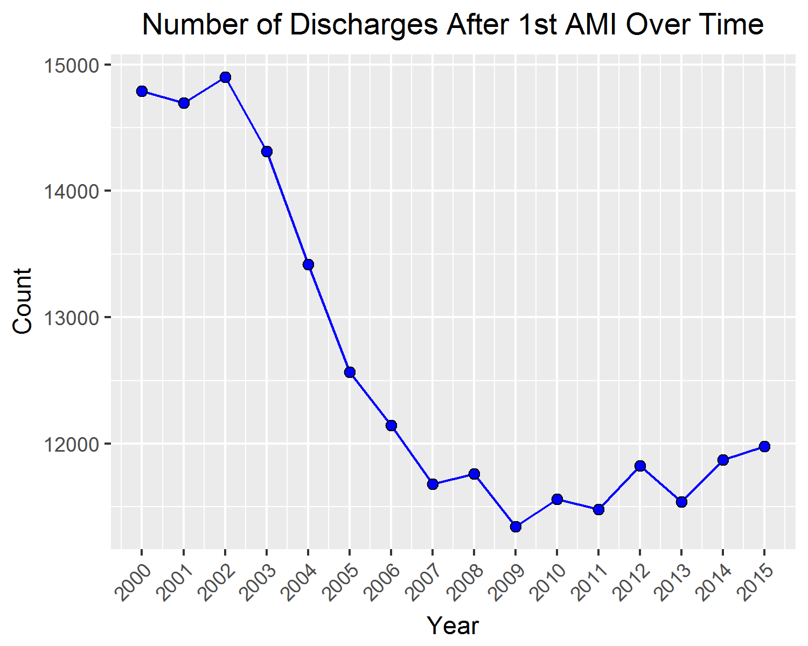

### Project1: Hospital Quality of Care Scores Association with Clinical Outcomes in MIDAS 
### Project2: Income Association with Clinical Outcomes in MIDAs
### Authors: Georgia Barbayannis, I-ming Chiu, Noah Michel, Davit Sargsyan   
### Created: 09/09/2016   

---

### 07/22/2017: Changes
#### a. Ran 'midas15_dakota_data_v2.R' script with the following changes:    
* NEW DEFINITION: Disorders of lipoid metabolism disorder now exludes ICD-9 codes 272.5, 272.6 and 272.7   
* NEW FILTER: in data from 2008 to 2015, keep inpatients' records only  
* NOTE: all records of patients who were admited before the age of 18 are removed  
   
The number of first AMIs is presented in the figure below:   
   

#### b. CV Death Definition
1. Major cardiovascular diseases: I00-I78   
2. Diseases of heart: I00-I09, I11, I13, I20-I51   
3. Hypertensive heart disease with or without renal disease: I11,I13  
4. Ischemic heart diseases: I20-I25  
5. Other diseases of heart: I00-I09,I26-I51   
6. Essential (primary) hypertension and hypertensive renal disease: I10,I12   
7. Cerebrovascular diseases: I60-I69   
8. Atherosclerosis: I70   
9. Other diseases of circulatory syste: I71-I78   

#### c. All-Cause vs. CV Death
| (%)                | Alive or Non CV Death | CV Death  |
|--------------------|-----------------------|-----------|
| Alive              | 66.4%                 | 0%        |
| All-Cause Death    | 16.4%                 | 17.2%     |

#### d. Started working on 'midas15_dakota_analysis_v3.R'. Continue with:   
* Define a mulilevel responses for 30, 90, 180 days and 1 year for all-cause death, CV death and AMI readmission   
* Models    
* ATTN: Use notes below from 07/21/2017!    

### 07/21/2017: Notes From a Weekly Meeting
* Exclude 3 subcodes of ICD-9 272.x   
* Make OR/HR plots into Forest plots (in ggplot2, possibly use 'coord_flip()', DS)    
* In logistic regression, use a single multi-level variable for the endpoints occuring within 30, 90, 180 days and 1 year   
* In all models, add interactions of each independent variable with hospital (e.g. HOSP*Score)    
* Use delta scores instead of scores: Delta Score = Score(Discharge Year + 1) - Score(Discharge Year  - 1)
* Define CV death using CAUSE variable. Use CV death as on of the endpoints   

### 06/05/2017
* Separated acute CHF records prior to 1st AMI from records at 1st AMI admissions
* Added chronic CHF

### 05/05/2017
* Finihsed data preprocessing, MIDAS15
* Added analysis example file in 'source'

### 04/21/2017

* Added 'midas15_dakota_data.R' source file. Based on Jen Wellings' 'HF after AMI' data subsetting.
* Insurance is now combined into just 3 categories (see the code for details). NOTE: update all current projects accordingly.

### 03/25/2017   

* Per Javier's advice, moved all data files outside project folders for faster load of the projects. 
* All data files are now located in 'DATA_HOME = C:/Users/ds752/Documents/git_local/data'

### 01/06/2017: Notes From a Meeting
* Analyze each subscore separately   
* Plot: number of hospitals reporting the scores and number of subscores each year (barplot), starting 2004   
* NEW: 2014 scores are online now, update the excel spreadsheet. Also, 2005 scores are now available on the website:   
www.???   
* Devide Report Year column into 2: Year Collected and Year Reported; some reports are based on previous years' data   
* Add PCI and PCI Time Limit columns (e.g. 90, 120, etc, minutes)   
* Download and save all reports; look at the calculations of overall scores. Looks like overall score is NOT the average of components but = # patients reveived care/# patients eligible for care. What does "received care" mean? Should the patient receive all submeasures to count toward the overall score or receiving at least one is enough? If the scores from different years are not compatible, should we analyze the correlation of scores with clinical outcomes for each year separately?   
   
NOTE: given the methodology drift, does delta score make sense?   

### 12/29/2016: Notes From a Meeting
Clinical outcomes: MI readmissions or deaths, death alone (CV and all-cause), MI readmissions alone, readmisson for any reason.   
   
* Check the clinical outcomes trend, specifically before and after implementation of public score reporting. Investigate 2008 specifically as in both our analysis and Ryan, Nallamothu and Dimick paper it shows a bump (see Exhibit 2). Try to examine possible seasonality effect.   
* Trend in overall scores - is there improvement from year to year of the scores?   
* Association of process of care scores with clinical outcomes, including adjustment for other risk factors such as year of first MI, age at first MI, gender of patient, teaching/nonteaching hospital , STEMI/NSTEMI, insurance , zip code (income), HF, hypertension, etc.   
* Additional adjustment for hospital to see if the improvement is driven by a handful of very good hospitals (hospital effect)? Need to see if the right lower graph remains significant if you correct for score and correct for hospital. Hospital driven effect – need to see the score effect.   
* Association of delta scores and patient outcomes, same analysis as (3) and (4) above.   

### Summary: 
Did trend of MI change after implementation of guidelines? There were different trends in both scores and outcomes, so how do they relate to each other? Since both change over time and change in different directions, if put them together shows there’s a huge effect so want to adjust to see if this was due to something else. Finally, adjust to see if there are only 1 or 2 hospitals that drive entire analysis and conclusion.   